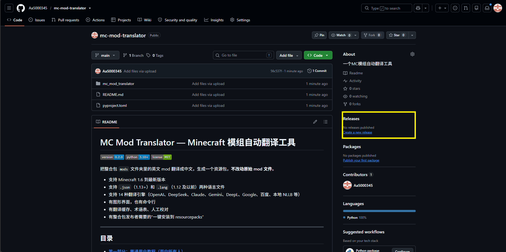
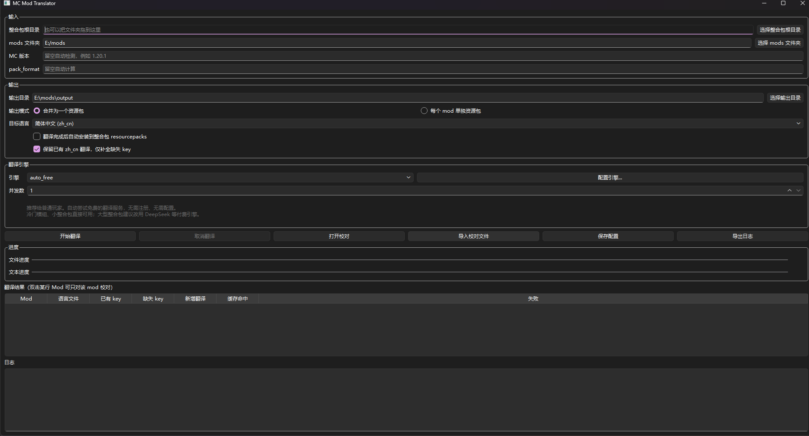
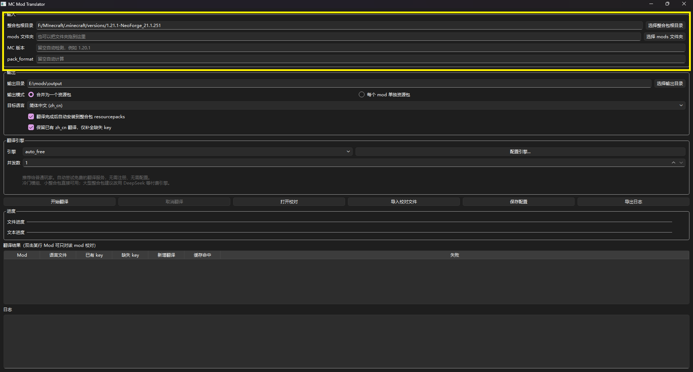
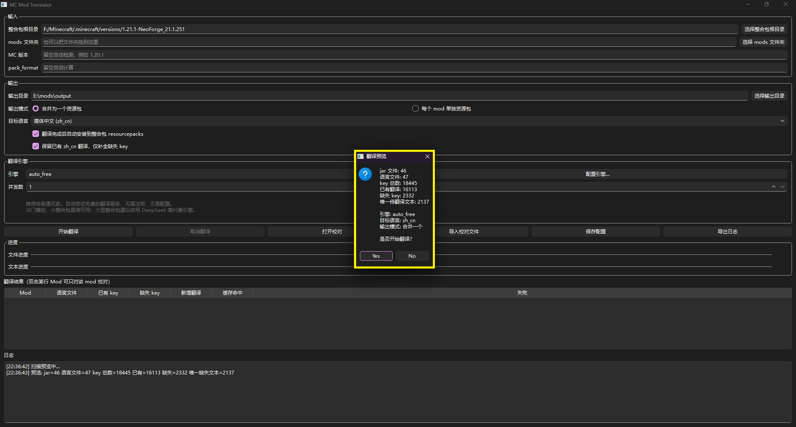
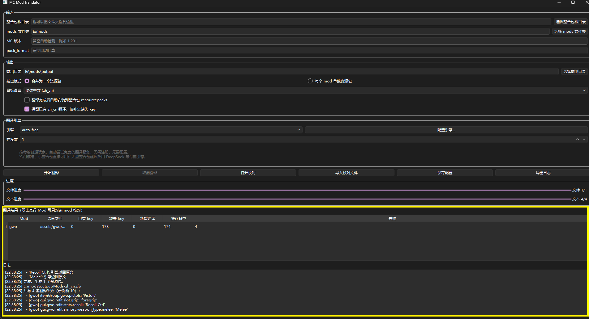
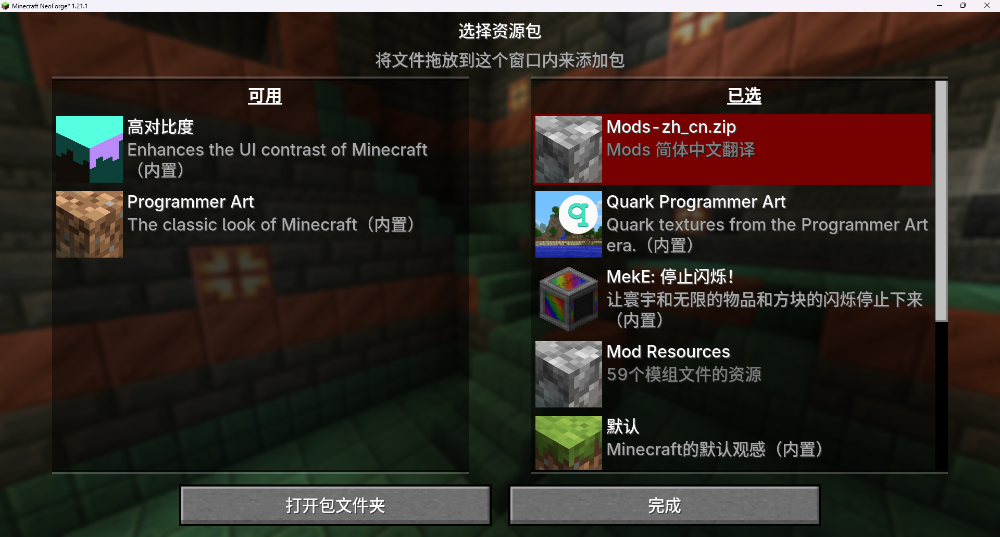
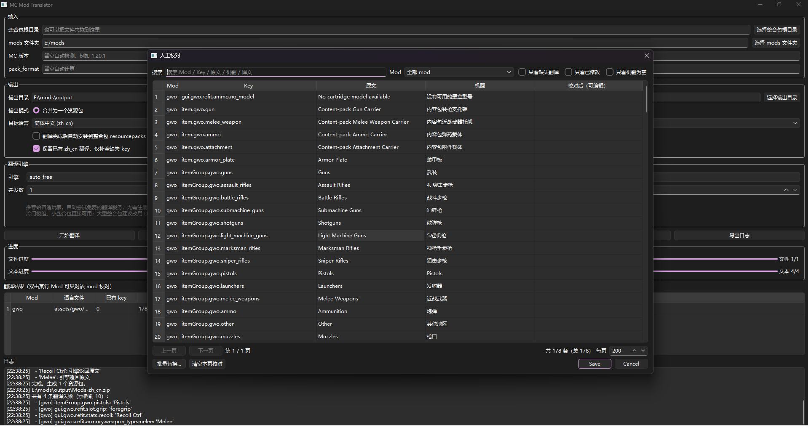
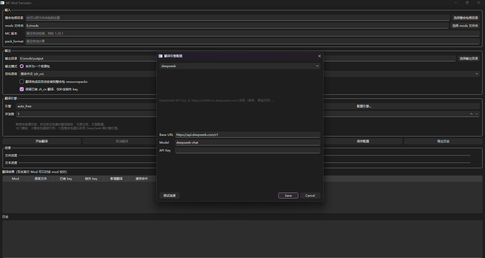

# MC Mod Translator — Minecraft 模组自动翻译工具

[](#)
[](#)
[](LICENSE)

把整合包 `mods` 文件夹里的英文 mod 翻译成中文，生成一个资源包，**不改动原始 mod 文件**。

**打开即用，无需注册、无需充值、无需配置。** 默认使用免费翻译服务，冷门模组也能翻。

- 支持 Minecraft 1.6 到最新版本
- 支持 `.json`（1.13+）和 `.lang`（1.12 及以前）两种语言文件
- 有图形界面，也有命令行
- 翻译缓存、术语表、人工校对
- 可选接入 14 种翻译引擎（DeepSeek、OpenAI、Claude 等）

---

## 目录

- [第一部分：玩家教程（面向所有人）](#第一部分玩家教程面向所有人)
  - [第 1 步：下载程序](#第-1-步下载程序)
  - [第 2 步：打开程序](#第-2-步打开程序)
  - [第 3 步：选择你的整合包](#第-3-步选择你的整合包)
  - [第 4 步：开始翻译](#第-4-步开始翻译)
  - [第 5 步：把翻译装进游戏](#第-5-步把翻译装进游戏)
  - [第 6 步（可选）：人工校对](#第-6-步可选人工校对)
  - [翻译效果不满意怎么办？](#翻译效果不满意怎么办)
- [第二部分：常见问题（FAQ）](#第二部分常见问题faq)
- [第三部分：进阶用法（可选）](#第三部分进阶用法可选)
- [第四部分：给开发者](#第四部分给开发者)
- [附录：截图清单](#附录截图清单)

---

# 第一部分：玩家教程（面向所有人）

> **不懂电脑也没关系。** 下面每一步都写清楚了"点哪里、看到什么算成功"。
> 如果你在某一步卡住了，请先看 [第二部分 FAQ](#第二部分常见问题faq)。

## 第 1 步：下载程序

1. 打开本项目的 **Releases**（发行版）页面。

2. 找到最新版本，在 **Assets** 里下载这个文件：

   ```
   MCModTranslator.exe
   ```

3. 把 `MCModTranslator.exe` **移动到一个你记得住的地方**，例如：

   - `D:\MCMT\MCModTranslator.exe`
   - 桌面新建文件夹 `MC工具`

> ⚠️ **不要**放在 `C:\Program Files` 或 `C:\Windows`，那样可能因为权限问题打不开。

> 💡 Windows 首次运行 exe 可能会弹"Windows 已保护你的电脑"，点击 **更多信息** → **仍要运行**。



---

## 第 2 步：打开程序

双击 `MCModTranslator.exe`。

等 5~15 秒（第一次启动会慢一点），你会看到一个窗口。



界面从上到下大致分 5 块：

| 区块               | 作用                     |
| ---------------- | ---------------------- |
| **输入**           | 告诉程序"我的整合包在哪里"         |
| **输出**           | 翻译好的资源包放哪里（自动填好，不用管）   |
| **翻译引擎**         | 默认是 `auto_free`，免费，不用改 |
| **按钮区**          | 开始翻译 / 取消 / 校对 / 保存配置  |
| **进度 + 表格 + 日志** | 显示当前进度和结果              |

> 第一次打开时，**什么都不用配置**。默认引擎 `auto_free` 会自动使用免费翻译服务。

---

## 第 3 步：选择你的整合包

在 **输入** 区块：

### 方式 1（推荐）：选择整合包根目录

1. 点击 **选择整合包根目录** 按钮
2. 在弹出的文件夹选择框里，找到你的整合包文件夹
   - 通常长这样：`D:\MyPacks\MyAdventurePack\`
   - 里面应该能看到 `mods` 文件夹、`config` 文件夹、`manifest.json` 等
3. 选中整合包文件夹本身（**不要进去选 mods**），点确定

### 方式 2：直接选 mods 文件夹

如果你已经知道 mods 文件夹在哪，也可以直接点 **选择 mods 文件夹**。

### 方式 3：拖拽（最快）

直接把整合包文件夹从 Windows 资源管理器里**拖到**输入框上。

> 📌 程序会自动在整合包根目录下找到 `mods` 文件夹。如果没找到，会提示"无法定位 mods 目录"，说明你选错了位置。

### 输出目录会自动填好

只要你选了整合包，**输出目录** 会自动填成：

```
<你的整合包>/resourcepacks
```

这是最方便的位置——翻译好的资源包会直接放到游戏的资源包文件夹里。

如果你想放到别处，点击 **选择输出目录** 按钮改。



---

## 第 4 步：开始翻译

确认界面：

| 项目                  | 建议值                |
| ------------------- | ------------------ |
| 翻译引擎                | `auto_free`（默认，免费） |
| 目标语言                | `简体中文 (zh_cn)`     |
| 输出模式                | `合并为一个资源包`         |
| 自动安装到 resourcepacks | ✅ 勾上（省事）           |
| 保留已有 zh_cn 翻译       | ✅ 勾上（避免重复）         |
| 并发数                 | `1`（免费服务限速，默认就是 1） |

点击 **开始翻译**。

### 会弹出一个预览框



上面会告诉你：

- 找到多少个 jar 文件
- 有多少个语言文件
- 一共多少个待翻译的 key
- 有多少已经是中文了（不会重复翻译）
- 真正需要翻译的唯一文本数

确认没问题，点 **是**。

### 等待翻译



你会看到两条进度条：

- **文件进度**：处理完了多少个语言文件
- **文本进度**：翻译了多少条文本

下面的日志会实时显示每条的翻译情况，包括重试、错误、缓存命中。

> ⏱ **时间参考**：100 个 mod、大约 2 万条文本，用免费引擎大约 20~60 分钟（取决于网络和额度）。
> 如果用付费引擎（见[进阶用法](#第三部分进阶用法可选)），大约 10~25 分钟。

### 如果想中途停止

点 **取消翻译** 按钮。程序会在完成当前正在翻译的几条后停下，已经翻译好的内容会保存到缓存里，下次继续翻译时不会重复请求。

### 完成

日志会显示：

```
完成。生成 1 个资源包。
D:\MyPacks\MyAdventurePack\resourcepacks\Mods-zh_cn.zip
```

结果表格会列出每个 mod 的：

| 列      | 含义                 |
| ------ | ------------------ |
| Mod    | mod 的 ID           |
| 语言文件   | 语言文件在 jar 内的路径     |
| 已有 key | jar 里原来就有的中文条数     |
| 缺失 key | 需要翻译的条数            |
| 新增翻译   | 本次新翻译的条数           |
| 缓存命中   | 从缓存里直接拿的条数（免费、即时）  |
| 失败     | 翻译失败回退成英文的条数（详见下文） |

---

## 第 5 步：把翻译装进游戏

### 情况 A：你在第 4 步勾了"自动安装"

资源包已经自动复制到 `<整合包>/resourcepacks/`。直接跳到下面的"在游戏里启用"。

### 情况 B：没勾自动安装

手动把 `<输出目录>/Mods-zh_cn.zip` 复制到：

```
<整合包>/.minecraft/resourcepacks/
```

或者（有些启动器）：

```
<整合包>/resourcepacks/
```

### 在游戏里启用

1. 启动游戏
2. 主菜单 → **选项...** → **资源包...**
3. 在左侧"可用"列表里找到 `Mods-zh_cn`
4. 点击箭头把它移到右侧"已选中"
5. 点 **完成**



进游戏后，mod 里的英文应该变成中文了。

> 💡 资源包要放在**默认**资源包之上才能生效，游戏会自动把它排到最上面。

---

## 第 6 步（可选）：人工校对

机器翻译难免有不通顺的地方。如果你想把某些词改成自己喜欢的译法：

1. 在主界面点击 **打开校对** 按钮。
2. 会弹出一个大表格。



### 校对窗口能做什么

- **搜索**：顶部搜索框可以搜 Mod 名、key、原文、机翻、译文
- **筛选**：
  - `只看缺失翻译`：只看机翻是空的
  - `只看已修改`：只看你已经改过的行
  - `只看机翻为空`：只看原文没翻译出来的
- **按 Mod 筛选**：右侧下拉框
- **批量替换**：点底部"批量替换..."按钮，比如把所有"剑"改成"短剑"
- **分页**：数据量大时一页显示 200 条，用"上一页/下一页"翻页

### 怎么校对

1. 找到想改的那一行
2. 双击**最后一列**（"校对后"）
3. 输入你的译文
4. 改完继续改其他的
5. 全部改完后点 **保存**

### 会自动保存草稿

即使你忘记点保存，程序也会**每 30 秒自动保存一次草稿**。下次打开校对窗口会自动恢复。

### 会检查占位符

如果原文里有 `%s`、`{0}` 这样的占位符，而你的译文里漏了，保存时会提示：

```
检测到占位符问题：
[mod_a] item.name: 缺少占位符 ['%s']

仍要保存吗？
```

看到这个提示，**先点"否"回去补上**，否则游戏里会出错。

### 校对完成后

改好的内容会写入缓存（引擎名 `manual`）。**下次翻译时会优先使用你的译文，不会重新调 API**。

---

## 翻译效果不满意怎么办？

`auto_free` 默认使用免费的翻译服务，有这些**客观限制**：

- 每天有额度上限（MyMemory 匿名约 1 万字符/天）
- 翻译质量一般（毕竟是免费的）
- 短词、专有名词有时翻译不出来

如果**你要翻译的整合包比较大**（50 个 mod 以上）或者**对翻译质量要求高**，建议换一个付费引擎：

- **DeepSeek**：中文质量好、价格极低（100 万 tokens 约 1 元）。100 个 mod 的整合包大约花 **0.5~2 元**
- **OpenAI**：质量最高，价格稍贵，100 个 mod 约 5~15 元

具体怎么注册和配置，看 [第三部分：进阶用法](#第三部分进阶用法可选)。

---

# 第二部分：常见问题（FAQ）

## 启动相关

### Q1：双击 exe 没反应 / 一闪而过

- **杀毒软件拦截**：把 `MCModTranslator.exe` 加入白名单
- **路径有中文或空格**：把 exe 移到 `D:\MCMT\` 这样的纯英文路径
- **缺 Visual C++ 运行库**：搜索安装 "Microsoft Visual C++ Redistributable 2015-2022 x64"

### Q2：报错 "Windows 已保护你的电脑"

点击 **更多信息** → **仍要运行**。这是因为 exe 没有花钱买数字签名。

### Q3：打开后界面空白 / 显示乱码

- Windows 10 以下版本可能不支持
- 试试右键 exe → 属性 → 兼容性 → 勾"以兼容模式运行"选 Windows 10

## 翻译相关

### Q4：提示"所有免费翻译服务都不可用"

可能原因：

- **网络不通**：检查能不能上网
- **SSL 证书问题**：命令行执行 `pip install -U certifi truststore` 后重启
- **免费服务临时故障**：等半小时再试
- **今天的额度用完了**：换用 其他引擎（见进阶用法）

### Q5：翻译后游戏里还是英文

按顺序检查：

1. 资源包是否真的复制到了 `resourcepacks` 文件夹
2. 游戏里 资源包 界面是否启用了它
3. 是否把它拖到了右侧列表的**最上面**（默认资源包之上）
4. mod 是否使用 `.lang` 而非 `.json`（1.12 及以前），程序的资源包名和内容是否正确
5. 重启一次游戏

### Q6：翻译后某些 mod 还是英文

- 那个 mod 可能没有 `en_us` 语言文件（语言文件在别的地方，比如代码里写死）
- 那个 mod 可能用了自定义的翻译方式（比如硬编码、或从网络加载）
- **该 mod 的某些文本翻译失败了**：看看结果表格的"失败"列，如果 >0，说明有若干条没翻译成功

### Q7：翻译很慢

- 免费引擎就是慢，因为要限速避免被拦截
- 换 其他引擎（见进阶用法）会快很多
- 第一次翻译本来就慢，第二次因为有缓存会快很多

### Q8：翻译质量不好

- 使用人工校对（见第 6 步）
- 编辑 `~/.mc_mod_translator/glossary.csv`，加入你自己的术语表（格式：`英文,中文`）
- 换 DeepSeek / OpenAI（见进阶用法）

### Q9：某些词应该统一翻译，但每次都不一样

编辑术语表 `glossary.csv`：

```csv
creeper,苦力怕
ender dragon,末影龙
```

保存后重新翻译即可（术语表命中优先级最高，不会调用 API）。

### Q10：翻译一次大概花多少钱？

用 `auto_free` 免费。用付费引擎参考（2025 年价格）：

| 引擎                 | 每 1 万条      | 每 100 个 mod 整合包 |
| ------------------ | ----------- | --------------- |
| DeepSeek           | 约 0.3~0.8 元 | 约 0.5~2 元       |
| OpenAI gpt-4o-mini | 约 1~2 元     | 约 3~8 元         |
| Google 翻译          | 免费（限流）      | 免费              |
| MyMemory           | 免费（每日限额度）   | 免费              |

### Q11：能不能完全离线？

能。用 `nllb` 引擎（本地模型，需要下载 2~3 GB 模型文件，第一次会慢）。

### Q12：我能同时翻译多个整合包吗？

可以。程序会缓存每个整合包的翻译，共用一个缓存库。第二个整合包会更快。

### Q13：程序会不会修改我的 mod 文件？

**不会**。程序只**读取** mod 文件，生成独立的资源包 zip。

### Q14：翻译日志想留着以后看

点击主界面右下角 **导出日志** 按钮，保存为 `.log` 文件。

### Q15：删掉的 mod 翻译还在缓存里怎么办

缓存按"原文文本"存，不是按 mod 存。删缓存：

```
删除文件 C:\Users\<你的用户名>\.mc_mod_translator\cache.db
```

下次翻译会重新调用 API（会重新请求，慎用）。

---

# 第三部分：进阶用法（可选）

> 如果你对免费引擎的翻译质量满意，**这一整节都可以跳过**。

## 为什么用付费引擎？

| 维度   | auto_free（免费） | DeepSeek（付费）      |
| ---- | ------------- | ----------------- |
| 价格   | 免费            | 约 1 元 / 100 个 mod |
| 额度   | 每天 1 万字符左右    | 用完充值              |
| 速度   | 慢（限速）         | 快                 |
| 质量   | 一般            | 好                 |
| QPS  | 很低            | 无限制               |
| 中断风险 | 有额度限制         | 充值就行              |

## 配置 DeepSeek（推荐）

DeepSeek 是目前性价比最高的选择：

1. 打开 <https://platform.deepseek.com/>
2. 注册一个账号（手机号或邮箱）
3. 左侧菜单 → **API Keys** → **创建 API Key**
4. 复制出来的那一长串字符（类似 `sk-xxxxxxxx`），**立刻粘贴到记事本保存**
5. 左侧菜单 → **充值**，充 10 元人民币（1 元就能翻几千条，10 元足够用很久）
6. 回到程序主界面：
   - 引擎下拉框选 `deepseek`
   - 点 **配置引擎...**
   - 在 **API Key** 里粘贴刚才的 Key
   - 点 **测试连接**，看到"成功"即可
   - 点 **保存**
   - 回主界面点 **保存配置**
7. 并发数可以改回 **8**



## 配置 OpenAI

同 DeepSeek，但注册在 <https://platform.openai.com/>，需要绑定信用卡。质量最高，价格略贵。

## 配置其他引擎

- **Claude**：<https://console.anthropic.com/>
- **Gemini**：<https://aistudio.google.com/>（有免费额度）
- **Google 翻译**：选 `google` 即可，不需要 Key（中国大陆需要代理）
- **百度翻译**：<https://fanyi-api.baidu.com/>，需要 App ID + App Key
- **本地 NLLB**：选 `nllb`，首次使用会下载模型

## 命令行（CLI）

如果你习惯命令行，或者需要批量处理：

```bash
# 使用整合包根目录，自动安装
mcmt translate --pack-root ./MyPack --auto-install

# 指定 mods 文件夹和输出目录
mcmt translate --mods-dir ./mods --output-dir ./out

# 使用 DeepSeek
mcmt translate --pack-root ./MyPack --engine deepseek

# 指定目标语言和并发
mcmt translate --pack-root ./MyPack --target-lang zh_tw --concurrency 16

# 只翻译缺失的，不重译已有中文
mcmt translate --pack-root ./MyPack --merge-existing

# 全部重译
mcmt translate --pack-root ./MyPack --no-merge-existing

# 导出校对 CSV
mcmt translate --pack-root ./MyPack --export-proof proof.csv

# 导入校对
mcmt proofread import --input proof.csv --target-lang zh_cn

# 从 mods 目录直接导出校对 CSV
mcmt proofread export --mods-dir ./mods --output proof.csv --only-modified

# 列出所有可用引擎
mcmt engines list

# 测试引擎连接
mcmt engines test --engine deepseek

# 直接打开 GUI
mcmt --gui
```

### 常用参数

| 参数                    | 说明                   |
| --------------------- | -------------------- |
| `--target-lang`       | 目标语言：`zh_cn`、`zh_tw` |
| `--concurrency`       | 并发数，默认 1             |
| `--no-cache`          | 不使用缓存（调试用）           |
| `--no-glossary`       | 不使用术语表               |
| `--no-merge-existing` | 不保留已有翻译，全部重译         |
| `--log-file`          | 日志文件路径               |
| `--gui`               | 启动 GUI               |

## 配置文件位置

所有数据都在这里：

```
C:\Users\<你的用户名>\.mc_mod_translator\
```

| 文件                     | 内容                |
| ---------------------- | ----------------- |
| `config.yaml`          | 公共配置（目标语言、引擎、路径等） |
| `secrets.enc`          | 加密的 API Key       |
| `key.bin`              | 加密密钥（不要分享给别人）     |
| `cache.db`             | 翻译缓存（可删，删后重新翻译）   |
| `glossary.csv`         | 术语表（可手工编辑）        |
| `gui_state.json`       | GUI 状态（上次目录、窗口大小） |
| `proofread_draft.json` | 校对草稿（自动保存）        |

## 术语表格式

`glossary.csv`：

```csv
en,zh_cn
creeper,苦力怕
ender dragon,末影龙
redstone,红石
diamond sword,钻石剑
```

- 每行一个词条，英文在前，中文在后
- 不区分大小写
- 术语表命中的文本**不会调用 API**，直接使用你的译文

## 环境变量（优先级最高）

不想把 Key 写在配置文件里，也可以设置环境变量：

```bash
set OPENAI_API_KEY=sk-xxx
set DEEPSEEK_API_KEY=sk-xxx
set ANTHROPIC_API_KEY=sk-ant-xxx
set GEMINI_API_KEY=xxx
set DEEPL_API_KEY=xxx
set MICROSOFT_TRANSLATOR_KEY=xxx
set BAIDU_APP_ID=xxx
set BAIDU_APP_KEY=xxx
```

设置后重启程序即可。

## 支持的所有引擎

| 引擎名              | 是否收费 | 是否需要 Key | 备注               |
| ---------------- | ---- | -------- | ---------------- |
| `auto_free`      | 免费   | 否        | **默认**，自动选择免费服务  |
| `mymemory`       | 免费   | 否        | 匿名每日 1 万字符       |
| `google`         | 免费   | 否        | 中国大陆需代理          |
| `deepseek`       | 付费   | 是        | 推荐               |
| `openai`         | 付费   | 是        | 质量最高             |
| `claude`         | 付费   | 是        | Anthropic        |
| `gemini`         | 免费额度 | 是        | Google AI Studio |
| `moonshot`       | 付费   | 是        | 月之暗面             |
| `qwen`           | 付费   | 是        | 阿里通义千问           |
| `openrouter`     | 付费   | 是        | 聚合多个模型           |
| `deepl`          | 免费额度 | 是        | 每月 50 万字符        |
| `microsoft`      | 免费额度 | 是        | Azure Translator |
| `baidu`          | 免费额度 | 是        | 每月 5 万字符         |
| `ollama`         | 免费   | 否        | 本地模型             |
| `libretranslate` | 免费   | 否        | 需要自建服务           |
| `nllb`           | 免费   | 否        | 本地模型，首次下载 2~3 GB |

---

# 第四部分：给开发者

## 环境准备

```bash
git clone <repo>
cd mc-mod-translator
python -m venv .venv
. .venv/bin/activate          # Windows: .venv\Scripts\activate
pip install -e ".[gui,dev]"
```

本地模型（可选）：

```bash
pip install -e ".[local]"
```

## 项目结构

```
mc_mod_translator/
├── langfile.py           # 语言码规范化、.json/.lang 读写
├── scanner.py            # 扫描 jar，识别 en_us.json / en_US.lang
├── scanner_preview.py    # 翻译前统计
├── packager.py           # 生成资源包 zip
├── translator.py         # 并发翻译 + 缓存 + 占位符校验
├── placeholder.py        # 占位符保护与还原
├── cache.py              # SQLite 缓存（WAL）
├── glossary.py           # 术语表
├── proofread.py          # 校对 CSV 导入导出
├── versions.py           # MC 版本检测 + pack_format
├── config.py             # 配置与密钥加密
├── progress.py           # CLI 单行进度条
├── cli.py                # 命令行入口
├── engines/
│   ├── base.py           # 引擎基类 + 异常体系
│   ├── builtin.py        # 14 种引擎实现
│   ├── free.py           # auto_free / mymemory（免费）
│   └── registry.py       # 引擎注册与工厂
└── gui/
    ├── main.py           # GUI 入口
    ├── main_window.py    # 主窗口
    ├── engine_dialog.py  # 引擎配置窗口
    ├── proofread_dialog.py  # 校对窗口
    ├── drop_edit.py      # 支持拖拽的输入框
    └── settings.py       # GUI 状态持久化

launcher.py               # PyInstaller 打包入口
```

## 运行测试

```bash
pytest                    # 全部
pytest tests/test_cache.py    # 单文件
pytest -k placeholder         # 按名筛选
```

## 打包 exe

**重要**：必须用仓库根的 `launcher.py` 作为入口，不要直接打包 `mc_mod_translator/gui/main.py`（相对导入会失败）。

```bash
pip install pyinstaller
pyinstaller --onefile --windowed --name MCModTranslator ^
  --collect-all PySide6 ^
  --collect-all shiboken6 ^
  --hidden-import PySide6.QtCore ^
  --hidden-import PySide6.QtGui ^
  --hidden-import PySide6.QtWidgets ^
  --hidden-import PySide6.QtSvg ^
  --exclude-module PyQt5 ^
  --exclude-module PyQt6 ^
  --exclude-module tkinter ^
  --exclude-module transformers ^
  --exclude-module torch ^
  --noconfirm --clean ^
  launcher.py
```

生成的 `dist/MCModTranslator.exe` 就是发行版。

## 自动构建与发布

推送到 `main` 触发 `Build Dev` 工作流（多平台构建）。打 `v*` tag 触发 `Release`（自动创建 GitHub Release 附加 exe）。

```bash
git tag v0.3.0
git push origin v0.3.0
```

## 相关文档

- [CONTRIBUTING.md](CONTRIBUTING.md) — 贡献指南
- [SECURITY.md](SECURITY.md) — 安全策略
- [CHANGELOG.md](CHANGELOG.md) — 变更日志

## License

MIT
